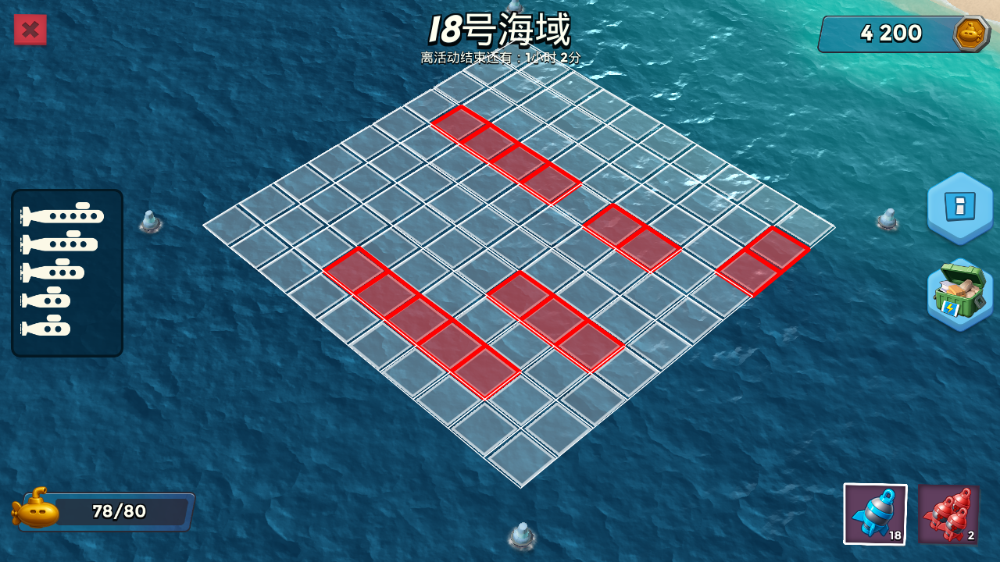

# BoomBeachSonarAuto

基于 **ADB + OpenCV** 的海岛奇兵声呐活动界面自动化与菱形网格识别工具。项目会通过 ADB 获取模拟器截图，使用模板匹配进入活动页面，读取人工校准点位或自动识别菱形网格中心点，优先使用搜索算法探索潜艇位置，缺少潜艇配置时回退逐格扫描，最后生成命中可视化图片。

> 说明：本项目仅用于图像识别、自动化流程和个人学习研究。使用前请确认不会违反目标应用的用户协议或平台规则。请自觉在24小时后删除。
建议有python或自动化工具开发基础的人员使用，使用本软件的风险完全由用户自行承担，作者不对任何直接或间接损失承担责任。

## 功能特性

- 通过 ADB 连接安卓模拟器或设备。
- 使用模板图片识别活动入口、登录按钮、退出按钮、母舰图标等 UI 元素。
- 支持按关卡配置不同菱形网格边长。
- 支持 1 至 50 号海域的自动化搜索算法探索，后续海域可手动配置扩展。
- 舍弃原有全海域迭代，使用潜艇搜索策略减少实际探测次数。
- 优先使用人工校准后的固定点位，点位缺失或数量不匹配时回退到自动识别。
- 通过 root ADB shell 使用 iptables 按游戏 UID 控制 DROP 弱网和 REJECT 断网。
- 蓝色离线探测与红色侦察在点击前都会核验 IPv4/IPv6 隔离状态；状态不可信时保持断网并停止。
- 支持“仅蓝色炮弹”和“红色侦察 + 蓝色攻击”两种模式，红色次数可在控制台设置为 1 至 10。
- 红色侦察每次得到可靠命中后，会立即切换蓝色炮弹在线提交这些点位，再继续下一次侦察。
- 使用进程生命周期文件锁保证 `main.py` 单实例运行，并持久化待处理探测事务用于崩溃恢复。
- 主流程通过日志输出状态、命中矩阵和结果图片路径。
- 弱网探索使用固定在终端底部的 `tqdm` 进度条，普通日志在上方滚动；底栏显示已找到潜艇格、已确认潜艇、探测次数、最坏剩余次数和脚本累计运行时间。
- 提供 PyQt6 运行控制台，可启动、停止、恢复网络、检查模拟器、查看实时日志和棋盘状态。
- 提供 PyQt6 调试工具，用于实时坐标查看、鼠标手势标点、ROI 选区、完整截图保存、模板保存、人工校准点位、弱网和断网开关诊断。
- 探测取证目录默认只保留最近 120 个批次，避免 `_debug/screenshots/probes/` 无限增长。

## 当前版本

- 支持 1 至 50 号海域的网格、参考图和点位配置。
- 使用潜艇搜索策略、命中邻格追击、完整潜艇安全区和保守逐格回退减少投弹次数。
- 支持从可见残骸和左侧潜艇进度恢复中途关卡状态。
- 支持红色炮弹离线侦察、蓝色炮弹即时提交和累计棋盘展示。
- 网络事务使用 pending 标记、DROP/REJECT 双规则、进程退出确认和 fail-closed 恢复保护。
- 控制台与日志均使用 UTF-8，并提供关键日志过滤和棋盘状态显示。

## 项目结构

```text
.
├── main.py                    # 主入口，执行自动化流程
├── config.py                  # 路径、ADB 设备、包名、日志、网格和模板匹配配置
├── run_control_panel.ps1      # 启动桌面运行控制台
├── run_with_overlay.ps1       # 启动主程序和模拟器左侧日志悬浮窗
├── stop_all.ps1               # 安全停止主程序并恢复网络
├── take_screenshot.py         # 保存海域截图到 save_points/imgs/，用于新增海域点位校准
├── requirements.txt           # Python 依赖
├── template/                  # 模板匹配所需图片
├── tools/
│   ├── control_panel.py       # 运行控制、日志和棋盘状态桌面界面
│   ├── log_overlay.py         # Windows 日志悬浮窗
│   └── platform-tools/        # 项目随附的 Windows ADB 工具
├── save_points/
│   ├── points.py              # 点位 JSON 读写、生成和读取工具
│   └── points.json            # 人工/自动生成的固定点位数据
├── utils/
│   ├── adb_control.py         # ADB 封装、手势、应用启动和弱网/断网控制
│   ├── image_match.py         # 模板匹配
│   ├── diamond_centers.py     # 菱形网格检测与中心点计算
│   ├── diamond_hit.py         # 点击前后截图对比与命中判断
│   ├── hit_map.py             # 命中矩阵投影与可视化图片输出
│   ├── pending_probe.py       # 待处理炮弹事务的持久化安全标记
│   ├── probe_protocol.py      # 单次弱网探测状态机与安全转换
│   ├── red_scout.py           # 红色侦察识别、规划和弹药指纹
│   ├── runtime_lock.py        # 主程序单实例文件锁和 PID 状态
│   ├── sidebar_progress.py    # 左侧潜艇进度和可见命中恢复
│   ├── submarine_strategy.py  # 潜艇搜索策略、确认和安全区推断
│   ├── wreck_detection.py     # 红色标记、残骸和完整潜艇检测
│   └── logger.py              # 日志配置
├── tests/                     # 策略和主流程单元测试
├── _debug/
│   ├── debug_gui.py           # 实时坐标/手势标点/ROI 选区/模板保存 GUI
│   ├── point_editor.py        # 人工点位校准 GUI
│   ├── weak_network_gui.py    # 弱网与断网开关、诊断 GUI
│   ├── screenshots/           # 调试截图输出
│   └── logs/                  # 日志文件
└── outputs/                   # 命中可视化结果输出
```

## 环境要求

- Python 3.10 或更高版本。
- Windows 10/11；主程序本身可移植，但控制台、PowerShell 启动脚本和日志悬浮窗按 Windows 环境维护。
- 仓库已包含 `tools/platform-tools/adb.exe`，通常不需要另外安装 ADB 或修改 `PATH`；缺少随附文件时才回退查找系统 `adb`。
- 一台已开启 ADB 调试的安卓设备或模拟器。
- 设备需要支持 `adb root`，否则脚本无法使用 iptables 自动控制弱网或断网。
- 海岛奇兵国服（国际服未测试），如需使用请自行修改 `GAME_PACKAGE_NAME` 和流程坐标。
- 建议使用雷电模拟器，并将分辨率设置为 `1280x720`。
- 当前模板图片与设备分辨率、游戏界面语言、UI 状态尽量一致。

## 安装

进入项目目录后运行：

```powershell
python -m venv .venv
.\.venv\Scripts\activate

pip install -r requirements.txt
```

如果在 macOS/Linux 上运行，虚拟环境激活命令通常为：

```bash
source .venv/bin/activate
```

## 配置

打开 `config.py`，按你的设备环境调整配置。

| 配置项 | 默认值 | 说明 |
| --- | --- | --- |
| `ADB_SERIAL` | `127.0.0.1:5555` | ADB 设备序列号或模拟器连接地址 |
| `ADB_EXE` | `tools/platform-tools/adb.exe` | 随仓库提供的 ADB 可执行文件 |
| `GAME_PACKAGE_NAME` | `com.tencent.tmgp.supercell.boombeach` | 默认控制的游戏包名 |
| `TEMPLATE_DIR` | `template/` | 模板图片目录 |
| `SCREENSHOT_DIR` | `_debug/screenshots/` | 截图和运行调试图保存目录 |
| `LOG_FILE` | `_debug/logs/bbma.log` | 主流程日志文件路径 |
| `OUTPUT_DIR` | `outputs/` | 命中可视化图片输出目录 |
| `MAX_PROBE_SAMPLE_DIRS` | `120` | 最多保留的探测取证批次数量 |
| `LEVEL_GRID_SIZES` | `1: 3` 到 `50: 10` | 各海域对应的菱形网格边长 |
| `SUBMARINES` | `1` 到 `50` | 各海域潜艇长度列表；后续海域需手动填写 |
| `USE_SAVED_POINTS` | `True` | 是否优先使用 `save_points/points.json` 中的人工点位 |
| `SAVED_POINTS_FILE` | `save_points/points.json` | 固定点位 JSON 文件 |
| `DEFAULT_MATCH_THRESHOLD` | `0.85` | 默认模板匹配阈值 |
| `DEFAULT_TEMPLATE_SHAPE_WEIGHT` | `0.9` | 模板形状相似度权重 |
| `DEFAULT_TEMPLATE_SHAPE_POWER` | `3.0` | 模板形状相似度放大系数 |
| `LOG_LEVEL` | `INFO` | 日志级别 |

连接设备前可以先检查 ADB：

```powershell
.\tools\platform-tools\adb.exe devices
.\tools\platform-tools\adb.exe connect 127.0.0.1:5555
```

如果你的设备不是 `127.0.0.1:5555`，请把 `config.py` 中的 `ADB_SERIAL` 改成 `adb devices` 显示的设备 ID。

弱网和断网控制依赖 root shell，运行 main.py 前建议确认：

```powershell
.\tools\platform-tools\adb.exe -s 127.0.0.1:5555 shell id -u
```

第二条命令输出 `0` 才表示当前 ADB shell 已具备 root 权限。

## 使用方法

1. 启动安卓模拟器或连接安卓设备，分辨率为 `1280x720`。
2. 确认设备已登录到游戏主界面，并且声呐活动入口可见。
3. 确认 `template/` 目录下的模板图片能匹配当前界面。
4. 优先通过控制台检查模拟器和选择炮弹模式，再启动主程序。

启动运行控制台：

```powershell
powershell -ExecutionPolicy Bypass -File .\run_control_panel.ps1
```

也可以在 IDE 或终端中直接启动控制台：

```powershell
.\.venv\Scripts\python.exe tools\control_panel.py
```

控制台提供以下操作：

- 启动和安全停止 `main.py`。
- 恢复 DROP/REJECT 网络规则。
- 检查目标 ADB 设备和 root 状态。
- 选择“仅蓝色炮弹”或“红色侦察 + 蓝色攻击”，并设置红色侦察次数。
- 查看关键日志、当前关卡、命中进度和棋盘状态。

不使用控制台时可直接运行主程序：

```powershell
.\.venv\Scripts\python.exe main.py
```

默认开启关卡自动识别。`config.py` 中的 `DEFAULT_LEVEL` 只在关卡识别不可用且允许回退时使用，不需要修改 `main.py` 底部入口。主程序带单实例锁，重复启动的第二个进程会立即退出，且不会修改第一个进程的网络状态。

运行结束后，命中可视化图片会保存到：

```text
outputs/hit_map_level_<level>.png
```

日志文件会保存到：

```text
_debug/logs/bbma.log
```

运行过程中的点击前后截图会保存到：

```text
_debug/screenshots/run_debug/
```

## 红色侦察模式

控制台支持两种炮弹流程：

- **仅蓝色炮弹**：沿用现有的单格流程，直接使用蓝色炮弹逐格确认并攻击。
- **红色侦察 + 蓝色攻击**：离线执行一次红色侦察，安全丢弃红色请求后，立即使用蓝色炮弹在线提交本次新识别到的可靠命中；随后继续下一次红色侦察，达到次数上限后再由搜索策略完成剩余格子。

红色侦察数量必须为 `1..10`，表示每关最多尝试的红色侦察事务数。红色炮弹点击后使用 Android 返回键退出活动，再在保持断网的情况下重新进入并采集多帧结果。红色结果无论命中与否都只能进入请求丢弃分支，不能提交；重启后还会复核红色炮弹数量，确认本次侦察没有消耗弹药。

红色侦察命中只是蓝色炮弹的高优先目标，只有蓝色真实结果会计入投弹进度。若蓝色在线结果在追加取证帧后仍不确定，程序会停止且不会重复点击该格，避免再次浪费炮弹。

如果发生网络隔离、游戏进程退出，或无法确认红色炮弹数量，流程必须停止并保持游戏断网。请使用控制台的“停止程序”或“恢复网络”；控制台会先重新阻断网络、强制停止游戏并确认进程退出，然后才清理规则。

## 支持自定义海域

目前已完全支持 1 至 50 号海域的自动化搜索算法探索。若想手动支持后续海域，需要补充潜艇长度和人工点位：

1. 修改 `config.py` 中的 `SUBMARINES`，填写目标海域的潜艇长度列表。潜艇长度可在声呐界面左侧查看。
2. 模拟器进入目标声呐界面，进入即可，不要手动拖放或缩放海域视角。
3. 修改 `take_screenshot.py` 中的保存路径，将截图保存为 `save_points/imgs/<海域编号>.png`，例如 `save_points/imgs/12.png`，然后运行：

```powershell
python take_screenshot.py
```

4. 使用点位校准工具打开刚才保存的截图，调整定位并保存：

```powershell
python _debug/point_editor.py
```

完成以上设置后即可支持自定义海域。懒得配置的话，可以等待作者后续更新。

## 人工点位

主流程默认 `USE_SAVED_POINTS = True`，会优先读取 `save_points/points.json`：

- 固定点位包含关卡截图路径、网格边长、图片尺寸、大菱形四角和每个小格中心点。

人工校准点位：

```powershell
python _debug/point_editor.py
```

点位校准 GUI 工具支持拖动外层大菱形四角、拖动每个小菱形中心点、重新规划海域菱形中心点，并保存到 `save_points/points.json`。

## 弱网控制

当前主流程已通过 ADB root + iptables 自动实现游戏网络控制，不再需要 QNET。离线点击前会创建 DROP 规则并核验 IPv4/IPv6 链完整性；未命中请求会在 DROP + REJECT 下强制停止游戏后丢弃，确认命中后才恢复网络提交请求。

项目同时提供 REJECT 断网能力。REJECT 使用独立 `BBMA_REJECTNET` 链，它并不会关闭整机 Wi-Fi 或移动数据。

检测到 pending 请求、损坏的 pending 状态或 `fail_closed` 状态时，退出清理不会自动解除网络规则。控制台恢复网络时会先安全停止游戏，避免客户端缓存请求在解网后补发。

也可以单独启动弱网/断网调试工具：

```powershell
python _debug/weak_network_gui.py
```

弱网调试工具支持以下操作，并读取对应 iptables/ip6tables 诊断信息：

- `开启弱网(DROP)`
- `关闭弱网(DROP)`
- `开启断网(REJECT)`
- `关闭断网(REJECT)`

专用日志保存到：

```text
_debug/logs/weak_network_gui.log
```

## 图片说明

启动脚本前需手动登录进主界面（如图）：
<p align="left"></p>

最终输出示例，红色方框即为潜艇：
<p align="left"></p>

## 调试工具

截图调试和模板裁剪 GUI：

```powershell
python _debug/debug_gui.py
```

常见用途：

- 自动点击位置不准时，查看鼠标实时坐标，左键单击标点，或输入 x/y 坐标跳转标记。
- 需要完整模拟器画面时，直接保存当前完整截图，避免拖拽裁剪漏掉边缘像素。
- 需要取消时，右键点标记可删除标记，右键空白或 ROI 区域可清除当前 ROI。
- 新设备或新分辨率适配时，可根据自己的模拟器左键拖拽（也可查看 ROI 的 `x, y, w, h`）选中 ROI 后保存到 `template/` 下，更新关键模板。

人工点位校准 GUI：

```powershell
python _debug/point_editor.py
```

弱网与断网开关、诊断 GUI：

```powershell
python _debug/weak_network_gui.py
```

## 模板图片说明

当前主流程会使用以下模板：

| 文件 | 用途 |
| --- | --- |
| `template/activity_button.png` | 活动入口按钮 |
| `template/login.png` | 登录按钮 |
| `template/quit_activity.png` | 活动详情页退出按钮 |
| `template/ship.png` | 母舰图标 |
| `template/retry.png` | 旧版断网重试图标 |
| `template/connection_interrupted.png` | 连接中断弹窗 |
| `template/connection_retry.png` | 连接中断弹窗中的重试按钮 |
| `template/victory_banner.png` | 声呐海域胜利界面 |
| `template/red_bomb_button.png` | 红色炮弹按钮定位和弹药指纹 |
| `template/red_hit_marker.png` | 红色侦察命中标志 |
| `template/visible_wreck_1.png` 至 `visible_wreck_3.png` | 可见残骸识别 |
| `template/submarine_hit_wreck.png` | 旧版残骸模板，当前严格命中流程不直接采用 |
| `template/sonar_pic_alive.png` | 声呐活动界面参考图标 |
| `template/win.png` | 旧版通过界面参考图标 |

`template/qnet_button_off.png`，为旧版 QNET 流程参考；当前主流程不再依赖该模板。

如果界面发生变化、分辨率不同或模板匹配失败，需要重新裁剪对应模板。

## 输出与调试文件

- `outputs/`：主流程结果图。
- `_debug/screenshots/`：运行过程中的截图和中间图。
- `_debug/screenshots/run_debug/`：点击前后截图、退出按钮匹配调试图。
- `_debug/screenshots/probes/`：每次蓝色探测的多帧取证；默认最多保留最近 120 个批次。
- `_debug/runtime/pending_probe.json`：可能待提交的炮弹请求安全标记；不要在游戏仍运行时手动删除。
- `_debug/runtime/status.json`：控制台读取的当前关卡、网络、进度和棋盘状态。
- `_debug/logs/bbma.log`：主流程日志文件。
- `_debug/logs/weak_network_gui.log`：弱网调试 GUI 日志文件。

## 常见问题

### 找不到 ADB 设备

先运行：

```powershell
.\tools\platform-tools\adb.exe devices
```

如果没有设备，检查模拟器是否开启 ADB，或重新执行：

```powershell
.\tools\platform-tools\adb.exe connect <设备地址>
```

然后同步修改 `config.py` 中的 `ADB_SERIAL`。

### 无法开启弱网或断网

可能原因：

- 当前设备不支持 `adb root`。
- `adb shell id -u` 输出不是 `0`。
- 设备缺少 `iptables`。
- 游戏包名配置不正确，导致无法读取 UID。

主流程启动时会执行 `adb.ensure_root_shell()`。如果无法获得 root shell，脚本会中止，避免弱网或断网控制弹出授权窗口或残留异常状态。

如果 REJECT 断网效果不明显，优先使用 `_debug/weak_network_gui.py` 查看 REJECT 诊断，确认 `BBMA_REJECTNET` 跳转规则和链内规则是否存在并被命中。

### 模板匹配失败

可能原因：

- 模板图片与当前分辨率不一致（请设置为 `1280x720`）。
- 模板区域裁剪过大或包含动态背景。

可以使用 `_debug/debug_gui.py` 左键拖拽 ROI 并保存为模板，再适当调整 `DEFAULT_MATCH_THRESHOLD`。

### 菱形网格识别失败

可能原因：

- 截图中网格区域被遮挡。
- 当前画面不是活动详情页。
- 使用了特殊的海岛基地皮肤（建议换为原版）。
- 当前关卡没有人工点位，且自动识别没有找到稳定外框。

建议优先使用 `_debug/point_editor.py` 为该关卡保存人工点位。也可以查看 `_debug/screenshots/` 下的中间图片，确认程序检测到的外框是否正确。

## License

本项目源码公开，仅允许非商业用途。

未经作者书面授权，禁止将本项目用于商业产品、付费服务、商业自动化、商业代练、商业测试、商业运营、二次售卖或任何直接/间接盈利场景。

详见 [LICENSE](./LICENSE)。
