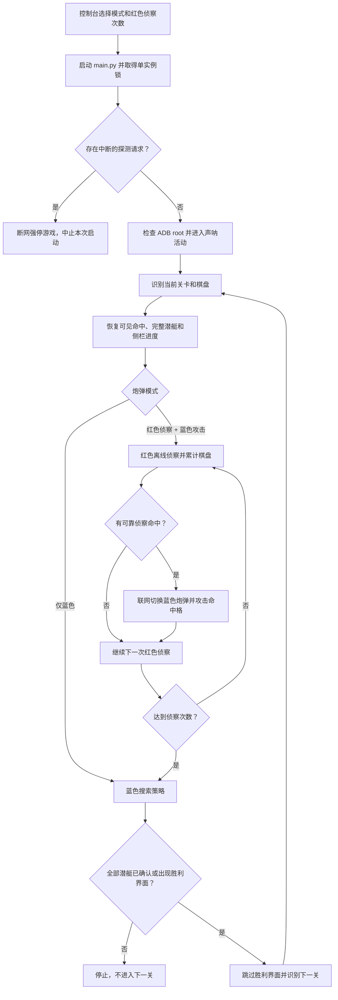
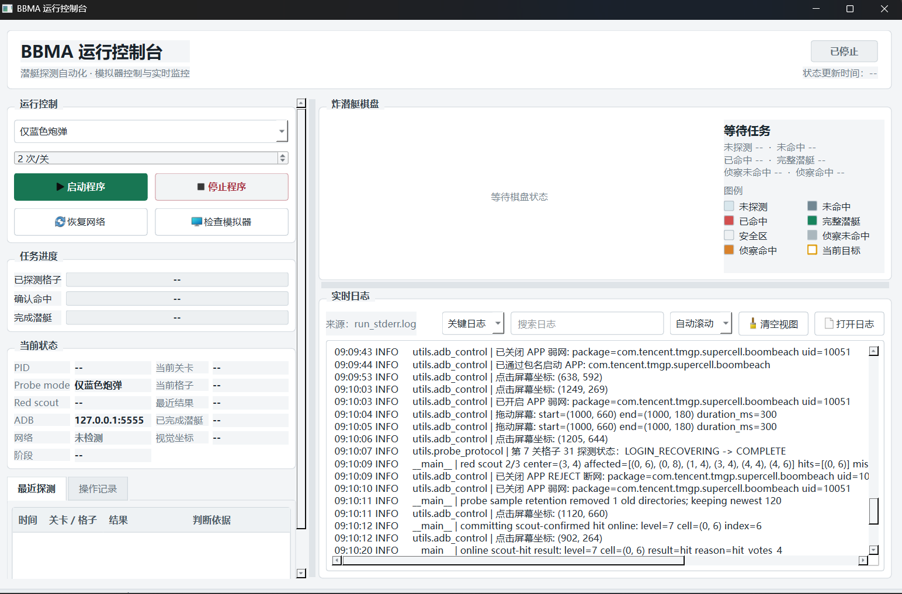

# BoomBeachSonarAuto

基于GameMainKH的海岛奇兵声呐潜艇自动化工具的二次开发

基于 **Python、ADB、OpenCV 和 PyQt6** 的《海岛奇兵》声呐活动自动化工具。程序通过 ADB 控制安卓模拟器，识别声呐棋盘、潜艇残骸、侧栏进度和胜利界面，并使用带安全约束的断网事务执行蓝色炮弹探测或红色炮弹侦察。

当前项目以以下环境为主要适配目标：

- Windows 10/11
- 国服《海岛奇兵》
- `1280x720` 模拟器分辨率
- 支持 `adb root`、`iptables` 和 `ip6tables` 的安卓模拟器
- 单台设备，默认 ADB 地址为 `127.0.0.1:5555`

> \[!WARNING]
> 本项目仅用于个人学习、图像识别和自动化研究。自动化操作、模板误判、网络规则异常和游戏界面变化都可能造成炮弹消耗、任务中断或账号风险。项目不能承诺零损耗，使用者需要自行确认其使用方式符合适用法律、平台规则和服务条款。

## 零基础一键安装

适用于 Windows 10/11。不会使用 Git、Python 或 PowerShell，也可以按下面的方式启动：

1. 在 GitHub 项目页面点击 **Code > Download ZIP**。
2. 下载完成后解压 ZIP；不要直接在压缩包预览窗口中运行文件。
3. 打开解压后的项目目录，双击 **`一键安装并启动.bat`**。
4. 第一次运行会自动检查 Python、创建 `.venv`、安装依赖、连接默认模拟器、请求 ADB Root 并验证 `id -u`，然后打开控制台。以后再次双击时会跳过已经完成的 Python 依赖安装。

如果电脑没有 Python，脚本会通过 Windows 自带的 `winget` 自动安装 Python 3.11。安装依赖需要能够访问 Python 软件源的网络。安装失败时窗口不会自动关闭，请保留窗口中的错误信息。

脚本会自动执行 `adb connect 127.0.0.1:5555`、`adb root`、等待设备重连，并要求 `adb shell id -u` 严格输出 `0`。模拟器尚未启动或检查失败时，Python 环境仍会保留并继续打开控制台，同时在窗口中显示具体原因。

脚本不能代替用户修改模拟器内部设置。第一次启动前仍需手动完成：

- 启动支持 Root 的安卓模拟器；
- 在模拟器设置中开启 Root、ADB 调试和本地 ADB 连接；
- 将模拟器分辨率设为 `1280x720`；
- 确认 ADB 地址为 `127.0.0.1:5555`；
- 登录游戏，并停留在游戏主界面

如果模拟器不是默认地址，脚本会列出检测到的其他设备，但不会在多设备场景下自动猜测目标。请修改 `config.py` 中的 `ADB_SERIAL` 后重新运行一键启动。

控制台打开后，先点击“检查模拟器”。只有目标设备已连接且 Root 状态显示为 `root (id=0)` 时，才启动自动化任务。

## 主要能力

- 提供桌面运行控制台，可启动、停止、恢复网络、检查模拟器、查看日志和实时棋盘。
- 支持“仅蓝色炮弹”和“红色侦察 + 蓝色攻击”两种运行模式。
- 自动识别当前海域，并按关卡加载网格尺寸、潜艇长度、参考图和校准点位。
- 支持 1 至 50 号海域；11 至 50 号海域当前共用默认的 `10x10` 网格和潜艇配置 `(2, 2, 3, 4, 5)`。
- 中途启动时尝试从可见残骸、部分残骸和左侧潜艇进度恢复当前棋盘。
- 命中后优先追击相邻格和潜艇延伸方向；确认完整潜艇后屏蔽周围一圈安全区。
- 策略无法完成时进入保守逐格扫描，并优先处理已命中位置附近的格子。
- 蓝色离线探测和红色侦察在点击前都会验证 IPv4/IPv6 网络隔离状态。
- 使用 `pending_probe.json`、DROP/REJECT 双规则、游戏进程退出确认和 `fail_closed` 状态保护待处理请求。
- 使用进程生命周期锁保证 `main.py` 单实例运行，避免多个脚本同时操作模拟器。
- 保存多帧识别证据、运行日志和命中图；普通探测保留最近 20 个批次，红色侦察保留最近 10 个批次，截图证据合计最多 500 MB。

## 运行流程



## 环境要求

| 项目     | 要求                                        |
| ------ | ----------------------------------------- |
| 操作系统   | Windows 10/11                             |
| Python | 3.10 或更高版本，推荐 3.11                        |
| 模拟器分辨率 | `1280x720`，不要手动缩放活动棋盘                     |
| 模拟器版本  | 雷电模拟器9                                    |
| ADB    | 仓库已包含 Windows Platform Tools              |
| Root   | `adb shell id -u` 必须输出 `0`                |
| 网络工具   | 模拟器内需要可用的 `iptables` 和 `ip6tables`        |
| 游戏版本   | 默认适配国服，国际服未验证                             |
| 游戏包名   | 默认 `com.tencent.tmgp.supercell.boombeach` |

普通真机通常无法满足 `adb root` 和网络规则要求。建议使用允许 ADB root 的安卓模拟器，并在模拟器设置中打开 Root、ADB 调试和本地 ADB 连接。

## 快速开始

普通用户推荐直接使用上面的“零基础一键安装”。下面的命令行步骤仅供需要手动管理 Python 环境的用户使用。

### 1. 获取项目

```powershell
git clone https://github.com/lwt15556/boom.git
cd boom
```

也可以直接进入已经下载好的项目目录。

### 2. 创建 Python 环境

```powershell
py -3.11 -m venv .venv
.\.venv\Scripts\python.exe -m pip install --upgrade pip
.\.venv\Scripts\python.exe -m pip install -r requirements.txt
```

需要进入虚拟环境时可以运行：

```powershell
.\.venv\Scripts\Activate.ps1
```

### 3. 连接模拟器

先启动模拟器并确认 ADB 调试已开启，然后运行：

```powershell
.\tools\platform-tools\adb.exe connect 127.0.0.1:5555
.\tools\platform-tools\adb.exe devices
```

设备列表应包含类似内容：

```text
127.0.0.1:5555    device
```

检查 Root 状态：

```powershell
.\tools\platform-tools\adb.exe -s 127.0.0.1:5555 root
.\tools\platform-tools\adb.exe -s 127.0.0.1:5555 shell id -u
```

最后一条命令必须输出 `0`。如果模拟器使用其他地址，请同时修改 `config.py` 中的 `ADB_SERIAL`。

### 4. 准备游戏界面

启动程序前应满足以下条件：

1. 游戏已经登录。
2. 当前位于游戏主界面，注意必须是原皮肤地图（有些皮肤的视角会高一些，不匹配）！！！
3. 声呐活动入口可见。
4. 模拟器分辨率为 `1280x720`。
5. 活动棋盘没有被手动拖动、缩放或遮挡。


### 5. 启动控制台

推荐使用控制台启动主程序在IDE终端运行：

```powershell
powershell -ExecutionPolicy Bypass -File .\run_control_panel.ps1
```

也可以在 IDE 或终端中运行：

```powershell
.\.venv\Scripts\python.exe tools\control_panel.py
```



## 控制台

控制台是当前项目的主要操作入口，不包含当前截图预览，主要提供以下功能：

| 功能    | 说明                              |
| ----- | ------------------------------- |
| 启动程序  | 使用当前选择的炮弹模式启动 `main.py`         |
| 停止程序  | 安全停止主程序，处理待丢弃请求并恢复网络            |
| 恢复网络  | 在确认主程序和游戏请求安全后清理 DROP/REJECT 规则 |
| 检查模拟器 | 显示 ADB 设备、目标设备和 Root 状态         |
| 实时日志  | 默认过滤截图和逐帧等待等高频日志，可切换详细日志        |
| 当前状态  | 显示 PID、网络、阶段、关卡、当前格子和最近结果       |
| 炸潜艇棋盘 | 显示真实命中、真实未命中、侦察结果、完整潜艇和安全区      |

程序运行期间不能修改炮弹模式和红色侦察次数。停止程序后才能开始新的配置。

## 炮弹模式

### 仅蓝色炮弹

这是默认模式。每个目标格执行一次完整的离线探测事务：

1. 确认活动详情页可用。
2. 创建 DROP 规则并验证 IPv4/IPv6 已隔离。
3. 保存点击前截图并写入待处理请求标记。
4. 点击蓝色炮弹目标格。
5. 点击活动左上角退出按钮。
6. 保持断网重新进入活动。
7. 采集多帧结果并结合残骸、侧栏和胜利界面判断。
8. 命中时恢复网络并提交请求。
9. 未命中时在 DROP 基础上短暂开启 REJECT，让现有连接立即失败并将请求标记为已丢弃；在 DROP/REJECT 仍生效时等待“连接中断”并识别“重试”按钮，确认按钮后立即解除 DROP 和 REJECT，再在联网状态点击“重试”。客户端快速重载后，程序会重新进入活动、滑动活动列表恢复位置，再打开活动详情。

结果明显不确定时，程序会先追加取证帧。普通离线探测在安全丢弃请求后最多重新检查同一个格子一次；仍然无法确认时停止任务。

#### 未命中快速恢复

普通蓝色炮弹确认未命中后，不再通过强制停止并重新打开游戏来丢弃请求，而是使用客户端的“连接中断/重试”流程：

1. 保持 DROP，离线投弹并判断结果。
2. 确认未命中后，在 DROP 基础上开启 REJECT。
3. REJECT 立即打断当前连接，并将本次请求标记为已丢弃。
4. 保持 DROP 和 REJECT，等待完整的“连接中断”弹窗。
5. 只有同时确认弹窗标题、说明和“重试”按钮后，才把事务切换为登录恢复状态。
6. 先解除 DROP，再解除 REJECT。
7. 在联网状态点击“重试”。
8. 等待客户端自行重载，不关闭或重新打开游戏。
9. 重新进入活动，执行两次列表滑动恢复目标活动的位置，再打开活动详情。

连接弹窗使用 `template/connection_interrupted_panel.png` 完整模板识别。程序只搜索屏幕中央 ROI，匹配阈值为 `0.95`，并从已确认弹窗内部的固定相对位置计算“重试”点击坐标；不会再在全屏搜索小型文字模板，避免把海面或右上角界面误识别为“重试”。当前模板按 `1280x720` 游戏画面校准，修改模拟器分辨率或游戏缩放后需要重新校准模板和 ROI。

程序最多等待 15 秒识别完整弹窗；正常情况下弹窗一出现就立即继续，不会固定等待满 15 秒。如果超时仍没有识别到弹窗，程序不会恢复网络，也不会关闭游戏，而是保留 DROP/REJECT、保持游戏进程和登录状态，并进入 `fail_closed`。只有请求状态仍然未知、网络隔离无法证明安全、进程异常或启动时发现遗留事务时，安全机制才会强制停止游戏。

### 红色侦察 + 蓝色攻击

红色炮弹只会选择尚未探索的格子作为投弹中心。初始可见命中、之前红色侦察覆盖过的格子，以及已经由蓝色炮弹确认命中或未命中的格子都属于已探索区域；即使规划器异常返回这些格子，主流程也会在点击前拒绝执行红弹事务。

控制台可设置每关执行 `1..50 `次红色侦察。每次侦察执行以下流程：

1. 断网并验证完整网络隔离。
2. 记录红色炮弹区域的弹药指纹。
3. 选择红色炮弹并点击一个新的侦察中心。
4. 使用 Android 返回键退出活动。
5. 保持断网重新进入活动并采集多帧结果。
6. 将可靠结果累计为侦察命中、侦察未命中或未知。
7. 在断网状态下强制停止游戏，丢弃红色请求。
8. 重开游戏后再次读取红色弹药指纹，确认红色炮弹没有被消耗。

每次红色侦察得到新的可靠命中后，当前代码会立即恢复网络、切换蓝色炮弹并在线攻击这些格子，然后继续下一次红色侦察。蓝色在线投弹不会再走离线回放流程，因此红色侦察误判可能直接消耗一颗蓝色炮弹。如果蓝色炮弹确认没有炸到潜艇，程序会立即把该格从“侦察命中”覆盖为真实“未命中”，清除命中图中的旧标记，并在后续寻路中跳过该格。在线投弹后的结果如果仍不确定，程序会停止，并且不会再次点击该格。

红色侦察阶段结束并进入普通蓝色寻路后，程序会先处理两类高优先级线索。两个或更多蓝色真实命中如果在同一行或同一列连续相连，程序会先复核这段命中线首尾方向上仍标记为“侦察未命中”的格子；首尾再次命中后，会按照新的首尾继续向外复核，尽快炸出完整潜艇。连续命中首尾处理完后，如果一个尚未归属完整潜艇的单独蓝色命中格，其棋盘内的上、下、左、右全部被标记为“侦察未命中”，程序再逐个复核这些邻格。L 形或断开的命中不会被当成一条潜艇，每个目标最多补炸一次，已经实际使用蓝色炮弹验证过的格子不会重复补炸；高优先级队列处理完后才继续普通寻路。

达到设置的红色侦察次数后，程序把累计侦察结果交给普通潜艇搜索策略，继续完成本关剩余目标。

不通过控制台直接运行红色模式时，可以设置环境变量：

```powershell
$env:BBMA_PROBE_MODE = "red_scout"
$env:BBMA_RED_SCOUT_COUNT = "2"
.\.venv\Scripts\python.exe main.py
```

恢复默认蓝色模式：

```powershell
$env:BBMA_PROBE_MODE = "blue_only"
Remove-Item Env:BBMA_RED_SCOUT_COUNT -ErrorAction SilentlyContinue
.\.venv\Scripts\python.exe main.py
```

## 棋盘状态

控制台棋盘使用以下状态：

| 状态    | 含义                        |
| ----- | ------------------------- |
| 未探测   | 当前没有可靠结果                  |
| 侦察未命中 | 红色侦察认为该格没有潜艇，尚未使用蓝色炮弹确认   |
| 侦察命中  | 红色侦察认为该格有潜艇，等待或正在使用蓝色炮弹确认 |
| 未命中   | 蓝色炮弹已经确认该格没有潜艇            |
| 已命中   | 蓝色炮弹已经确认该格命中潜艇            |
| 完整潜艇  | 已根据连续命中、潜艇长度或侧栏进度确认完整潜艇   |
| 安全区   | 完整潜艇周围一圈，不再投弹             |

当前目标格会使用额外边框标记。鼠标悬停棋盘格可以查看行、列和状态。

## 识别与寻路

### 关卡和点位

程序默认自动识别当前关卡，优先读取 `save_points/points.json` 中的人工校准点位。固定点位必须满足数量、边界、凸四边形和无重复等安全检查；检查失败时才回退到自动菱形网格识别。

如果关卡识别结果不够可信，程序默认停止，不会直接使用猜测的关卡继续投弹。`DEFAULT_LEVEL` 只用于允许回退或手动调用时的备用值。

### 中途恢复

每关开始时会检查：

- 可见残骸格子；
- 部分潜艇残骸；
- 左侧已完成潜艇长度；
- 能够唯一确定的完整潜艇位置。

完整潜艇会立即屏蔽周围安全区。无法从当前画面恢复的历史未命中格会保留为“未探测”，因此中途启动时仍可能再次检查这些位置。默认控制台不会跨账号读取历史投弹记录。

### 目标优先级

普通策略选择下一格的优先级大致为：

1. 尚未使用蓝色确认的侦察命中格。
2. 已形成方向的连续命中潜艇两端。
3. 最近命中格的上下左右邻格。
4. 剩余潜艇可能摆放方案中覆盖频率最高的格子。
5. 按最短剩余潜艇长度生成的跳格搜索位置。
6. 策略无法完成时，对剩余安全格进行保守扫描。

## 网络安全机制

程序不会关闭模拟器整机 Wi-Fi，而是通过 Root shell 按游戏 UID 管理专用规则：

- `DROP`：阻断游戏请求，用于点击后离线查看本地结果。
- `REJECT`：在 DROP 基础上立即拒绝连接，使客户端快速收到连接失败并显示“连接中断/重试”。
- IPv4 和 IPv6：点击前同时检查 OUTPUT 跳转和专用链内规则。
- `pending_probe.json`：记录可能尚未提交或丢弃的探测事务。
- `fail_closed`：无法证明网络安全或无法确认游戏已停止时，保留断网并终止流程。

不要在游戏仍运行时手动删除 `_debug/runtime/pending_probe.json`，也不要直接删除 iptables 规则。请使用控制台的“停止程序”或运行：

```powershell
powershell -ExecutionPolicy Bypass -File .\stop_all.ps1
```

如果启动时发现上一次留下的待处理请求，程序会先阻断网络、强制停止游戏并中止本次启动。安全清理成功后重新启动程序；如果游戏停止或网络规则检查失败，则保持 `fail_closed`，需要先查看日志。

## 配置

常用配置位于 `config.py`：

| 配置项                                 | 默认值                                    | 说明                      |
| ----------------------------------- | -------------------------------------- | ----------------------- |
| `ADB_SERIAL`                        | `127.0.0.1:5555`                       | 目标模拟器或设备序列号             |
| `ADB_EXE`                           | `tools/platform-tools/adb.exe`         | 仓库内置 ADB 路径             |
| `GAME_PACKAGE_NAME`                 | `com.tencent.tmgp.supercell.boombeach` | 游戏包名                    |
| `MAX_LEVEL`                         | `50`                                   | 自动任务允许处理的最大关卡           |
| `DEFAULT_LEVEL`                     | `2`                                    | 自动识别不可用时的备用关卡           |
| `AUTO_DETECT_LEVEL`                 | `True`                                 | 是否自动识别当前关卡              |
| `REQUIRE_CONFIDENT_LEVEL_DETECTION` | `True`                                 | 识别不确定时是否拒绝继续投弹          |
| `LEVEL_GRID_SIZES`                  | 关卡映射                                   | 每关菱形棋盘边长                |
| `SUBMARINES`                        | 关卡映射                                   | 每关潜艇长度列表                |
| `USE_SAVED_POINTS`                  | `True`                                 | 是否优先使用人工校准点位            |
| `SAVED_POINTS_FILE`                 | `save_points/points.json`              | 人工点位数据文件                |
| `DEFAULT_MATCH_THRESHOLD`           | `0.85`                                 | 通用模板匹配阈值                |
| `MAX_PROBE_SAMPLE_DIRS`             | `20`                                   | 最多保留的普通探测证据批次           |
| `MAX_RED_SCOUT_SAMPLE_DIRS`         | `10`                                   | 最多保留的红色侦察证据批次           |
| `MAX_SCREENSHOT_STORAGE_BYTES`      | `500 MB`                               | 普通探测、红色侦察和运行调试截图的合计容量上限 |
| `LOG_LEVEL`                         | `INFO`                                 | 日志级别                    |

修改分辨率、游戏版本或包名后，固定坐标和模板图片通常也需要重新校准。

## 运行方式

### 控制台运行

```powershell
powershell -ExecutionPolicy Bypass -File .\run_control_panel.ps1
```

### 直接运行主程序

未设置环境变量时默认使用仅蓝色模式：

```powershell
.\.venv\Scripts\python.exe main.py
```

### 主程序和左侧日志悬浮窗

```powershell
powershell -ExecutionPolicy Bypass -File .\run_with_overlay.ps1
```

该脚本使用当前环境中的炮弹模式；没有设置时仍为仅蓝色模式。

### 安全停止

```powershell
powershell -ExecutionPolicy Bypass -File .\stop_all.ps1
```

不要同时启动多个入口。主程序会通过文件锁拒绝第二个 `main.py`，但多个外部工具仍可能增加排查难度。

## 输出文件

| 路径                                  | 内容                         |
| ----------------------------------- | -------------------------- |
| `_debug/logs/bbma.log`              | 主程序日志                      |
| `run_stdout.log` / `run_stderr.log` | PowerShell 或控制台启动时的标准输出和错误 |
| `_debug/runtime/status.json`        | 控制台读取的实时状态和棋盘数据            |
| `_debug/runtime/pending_probe.json` | 待处理炮弹事务安全标记                |
| `_debug/screenshots/run_debug/`     | 红色选择、退出、弹药核验等流程截图          |
| `_debug/screenshots/probes/`        | 蓝色探测的多帧截图和 JSON 判断结果       |
| `outputs/hit_map_level_<level>.png` | 每关结束时生成的命中图                |

识别成功时只保存代表性的 `before`、`after`、弹药核验和选择关键帧；最终结果为 `unknown` 或流程异常时保存全部帧。容量超限时从最旧的已完成样本开始清理，仍有待提交请求的当前样本不会被删除。主日志单文件达到 5 MB 后自动轮转，当前文件加 3 个历史文件，合计保留 4 个。每关结束时日志和运行状态会记录当前进程的 Working Set 与 Private Memory。

### 探测样本标注和离线评测

每个 `_debug/screenshots/probes/<样本目录>/` 可以增加一个不会覆盖程序结果的 `review.json`：

```json
{
  "ground_truth": "hit",
  "note": "多帧可见稳定残骸"
}
```

`ground_truth` 只接受 `hit` 或 `miss`。完成一批人工标注后运行：

```powershell
.\.venv\Scripts\python.exe tools\evaluate_probe_samples.py
```

报告会输出已标注/未标注数量、假命中、漏命中、`unknown` 数量、命中精确率和召回率。程序还会对普通蓝弹结果生成配准后的时间中位数图像分析，并把局部变化、外围变化和配准质量写入 `result.json` 的 `stable_analysis`。稳定分析目前只会把可疑的 `miss` 提升为 `unknown`，不会单独产生 `hit`，避免在标注样本不足时增加假命中风险。

运行日志、运行时状态、探测截图和输出图片默认不会提交到 Git。

## 校准和调试工具

### 截图、坐标和模板工具

```powershell
.\.venv\Scripts\python.exe _debug\debug_gui.py
```

可用于查看坐标、标点、选择 ROI、保存完整截图和重新裁剪模板。

### 人工点位编辑器

```powershell
.\.venv\Scripts\python.exe _debug\point_editor.py
```

可调整大菱形四角和每个格子的中心点，并保存到 `save_points/points.json`。

### 网络规则诊断

```powershell
.\.venv\Scripts\python.exe _debug\weak_network_gui.py
```

用于单独测试 DROP、REJECT、iptables 和 ip6tables 规则。不要在主程序探测事务进行中手动切换网络规则。

### 关卡参考截图

`save_points/imgs/1.png` 至 `50.png` 用于关卡识别。`take_screenshot.py` 是简单开发辅助脚本，当前保存目标仍写死为 `save_points/imgs/14.png`；使用前需要修改目标文件名，避免覆盖已有参考图。

## 项目结构

```text
.
├── main.py                     # 自动化主流程
├── config.py                   # ADB、关卡、路径和识别配置
├── run_control_panel.ps1       # 启动桌面控制台
├── run_with_overlay.ps1        # 启动主程序和日志悬浮窗
├── stop_all.ps1                # 安全停止并恢复网络
├── requirements.txt            # 运行依赖
├── template/                   # UI、胜利、红色炮弹和残骸模板
├── save_points/
│   ├── imgs/                   # 1 至 50 关参考截图
│   ├── points.json             # 人工校准点位
│   └── points.py               # 点位读写工具
├── tools/
│   ├── control_panel.py        # 运行控制台
│   ├── log_overlay.py          # 日志悬浮窗
│   └── platform-tools/         # Windows ADB 工具
├── utils/
│   ├── adb_control.py          # ADB、应用和网络控制
│   ├── diamond_hit.py          # 单格命中识别
│   ├── red_scout.py            # 红色侦察分析和规划
│   ├── submarine_strategy.py   # 潜艇搜索和安全区策略
│   ├── sidebar_progress.py     # 左侧潜艇进度识别
│   ├── pending_probe.py        # 待处理事务持久化
│   └── runtime_lock.py         # 单实例锁和 PID 状态
├── _debug/                     # 调试 GUI、日志和运行截图
├── tests/                      # 单元测试
└── outputs/                    # 每关命中图
```

## 常见问题

### 没有使用原地图皮肤

有些地图的视角会被拉高，以展示皮肤。

导致识图和使用炮弹出现问题，请换回原皮肤

### 控制台启动后 `main.py` 很快退出

常见原因包括：

- 当前不在游戏主界面
- ADB 设备未连接；
- Root shell 不可用；
- 当前关卡识别不够可信；
- 另一个 `main.py` 已经运行；
- 检测到上次中断的待处理请求；
- 网络隔离规则没有通过安全检查。

先查看控制台实时日志，再检查 `_debug/logs/bbma.log` 和 `run_stderr.log`。

### ADB 显示 `offline` 或找不到设备

```powershell
.\tools\platform-tools\adb.exe kill-server
.\tools\platform-tools\adb.exe start-server
.\tools\platform-tools\adb.exe connect 127.0.0.1:5555
.\tools\platform-tools\adb.exe devices
```

同时确认模拟器没有占用另一个 ADB 端口，并检查 `ADB_SERIAL`。

### 无法开启 DROP 或 REJECT

检查：

- `adb shell id -u` 是否为 `0`；
- `iptables` 和 `ip6tables` 是否存在；
- 游戏包名是否正确；
- 游戏 UID 是否能被读取；
- 模拟器是否在重启后取消了 Root。

可以使用 `_debug/weak_network_gui.py` 查看 OUTPUT 跳转和专用链规则。

### 命中识别率低

优先检查：

- 分辨率是否严格为 `1280x720`；
- 游戏 UI、语言或活动素材是否发生变化；
- 棋盘是否被拖动或缩放；
- `save_points/points.json` 中的当前关卡点位是否正确；
- `template/` 中的红色标志、残骸和胜利模板是否适配当前画面；
- `_debug/screenshots/probes/` 中点击前后截图是否包含动画遮挡。

不要只通过降低模板阈值提高识别数量。阈值过低会增加假命中，并可能直接消耗炮弹。

### 程序停止后游戏仍处于断网状态

这通常表示仍有待处理请求，或者程序进入了 `fail_closed`。先确认主程序已经停止，再通过控制台点击“恢复网络”。控制台会在清理规则前安全停止游戏，避免缓存请求在联网后补发。

### 中途开始时没有恢复所有已炸格

程序只能可靠恢复当前画面上仍然可见的残骸、完整潜艇和侧栏完成信息。已经炸过但未命中的格子通常没有稳定视觉标记，因此会保持“未探测”，后续可能再次检查。

## 开发和验证

运行全部单元测试：

```powershell
.\.venv\Scripts\python.exe -m unittest discover -s tests -v
```

检查 Python 文件是否能够编译：

```powershell
.\.venv\Scripts\python.exe -m compileall main.py config.py tools utils tests
```

项目测试主要覆盖图像判断辅助逻辑、潜艇策略、红色侦察、网络控制、待处理事务、控制台和主流程分支。单元测试不能替代真实模拟器上的界面、网络和弹药验证。

## 当前限制

- 主要适配单一分辨率、国服界面和单台 Root 模拟器。
- 11 至 50 关使用同一套默认潜艇长度，游戏活动变化后需要重新核对。
- 模板、固定坐标和人工点位对游戏 UI 变化较敏感。
- 中途恢复无法可靠识别历史未命中格。
- 红色侦察后的蓝色在线攻击依赖侦察结果，假命中可能消耗蓝色炮弹。
- 红色弹药指纹用于降低红色炮弹被提交的风险，但无法替代真实环境验证。
- 自动化出现不确定状态时会优先停止，可能需要人工恢复网络和重新启动。

## License

本项目使用 [Noncommercial Source-Available License with Disclaimer](LICENSE)。允许个人学习、研究、非商业测试和非商业修改；未经书面授权，不得用于付费服务、商业自动化、商业代练、二次售卖或其他直接、间接盈利场景。
